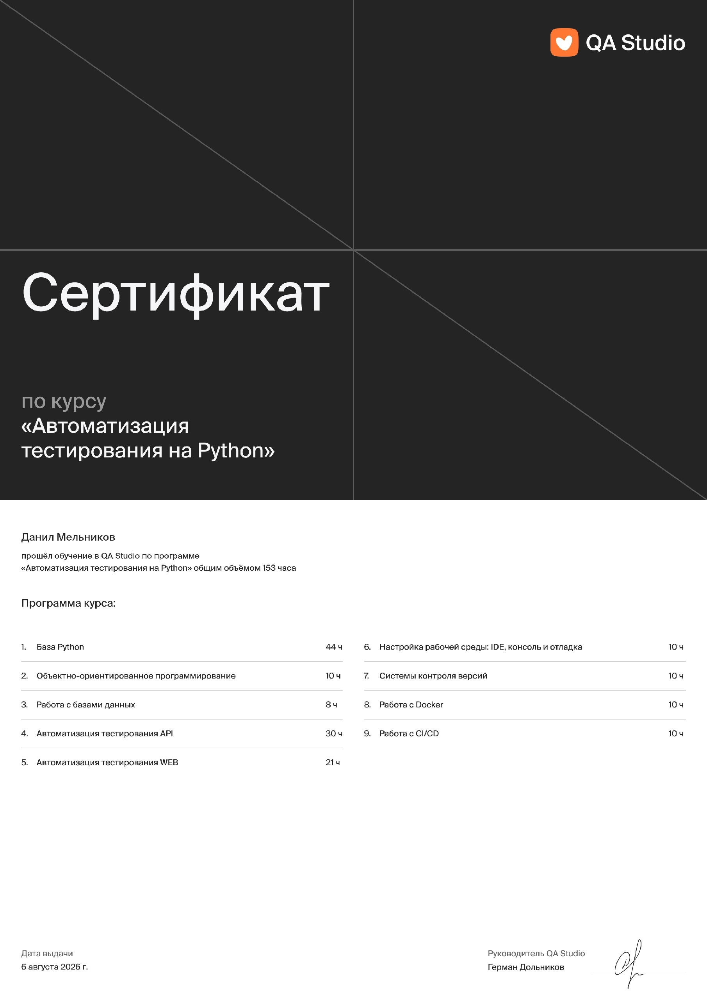

# Привет! Меня зовут Данил 👋

### QA Automation Engineer

- 🐍 Пишу автотесты на Python
- 🔬 Тестирую API и UI
- 🚀 Настраиваю CI/CD и работаю с Docker
- 📊 Формирую отчёты в Allure Report

---

## 🛠️ Мой стек

---

## 📁 Мои проекты

| My Shows Rating API | Pokemon Battle API | Pokemon Battle UI |
|---------------------|-------------------|-------------------|
| [my-shows-api-tests](https://github.com/danil-melnikov/my-shows-api-tests) | [pokemonbattle-api-tests](https://github.com/danil-melnikov/pokemonbattle-api-tests) | [pokemonbattle-e2e-tests-playwright](https://github.com/danil-melnikov/pokemonbattle-e2e-tests-playwright) |
| Pytest, Requests, Docker | Pytest, Requests, GitLab CI | Playwright, GitLab CI |

---

## 📚 Обучение

**QA Studio** — Автоматизация тестирования на Python (2026)

---

## 📞 Контакты

